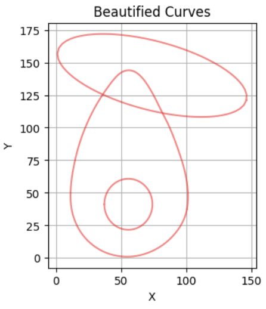
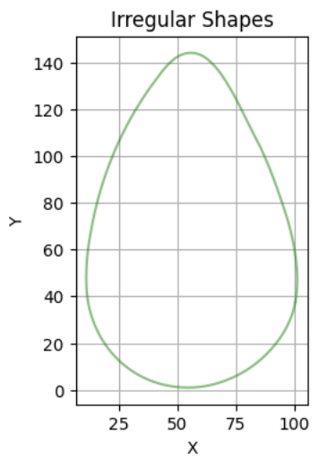
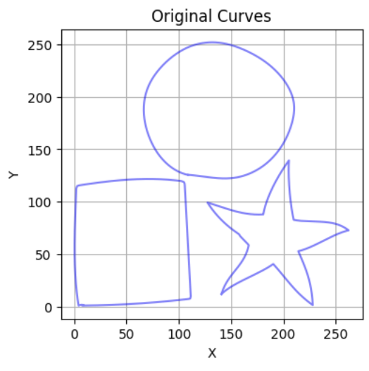
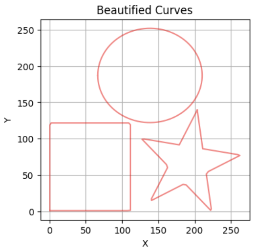
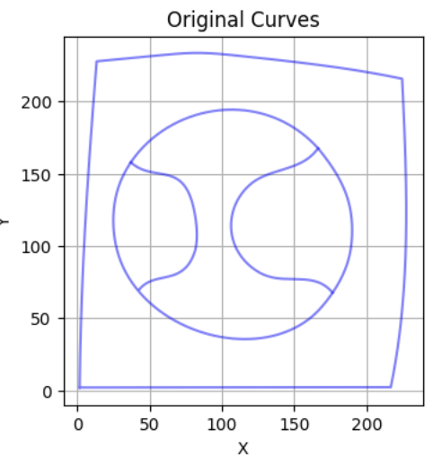
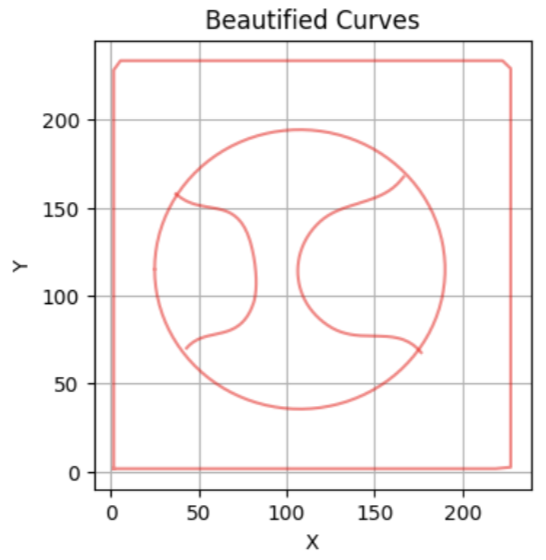
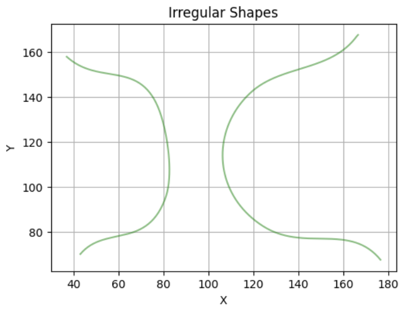

Curvetopia 🌈

Welcome to Curvetopia, a project born out of the Adobe Gensolve Hackathon, where curves aren't just shapes—they're art! This repository showcases my approach to identifying, regularizing, and beautifying a wide array of 2D curves. Whether you're a geometry enthusiast, a coding wizard, or someone who appreciates the elegance of symmetry, Curvetopia offers something special for you.

🎯 Objective:

Our mission is simple yet ambitious: to bring order and beauty to the chaotic world of 2D Euclidean space. We're starting with closed curves and working our way up to more complex shapes. Along the way, we'll explore the mesmerizing world of symmetry and master the art of curve completion. In short, we're on a journey to make every curve a masterpiece.

Firsty we look into the regular curves i.e. lines, Square, Rectangle, Triangle, Ellipse, Pentagon, Hexagon, Heptagon, Octagon.

- **Identify**: Pinpoint those curves which closely resemble to the above mentioned regular shapes.
- **Regularize**: Transform irregular shapes into their ideal, symmetrical forms.
- **Beautify**: Replace imperfect curves with their perfectly aligned counterparts.
  
Our approach leverages the power of Shape Context to match and regularize curves. By creating bounding boxes around contours and aligning them using PCA (Principal Component Analysis), we achieve precise shape formation. Whether it's a square, ellipse, or any polygon, we've got it covered!

As you can see in "occlusion1.csv" the ellipse and circle are regularised, and occlusion is also perfectly handled.

As you can see in "isolated.csv" the square, circle and star are regularised perfectly.

💻 How It Works: Shape Identification, Regularization, and Code Highlights:

We begin by identifying shapes through their contours and comparing them with a set of reference shapes. This process involves matching and classifying each shape using Hungarian Matching to measure how closely the contour matches one of our reference shapes. If a match is found with a score below 10, the curve is replaced with a perfected version. For rectangles and ellipses, we align the bounding box along the PCA axis to achieve flawless symmetry.

📀 Symmetry Detection in Irregular Shapes:

We then find the number of lines of symmetry present in irregular shapes (assuming that if present, they will be along the PCA axis).

- **PCA Analysis:** We find the PCA major and minor axes for the irregular shapes.
- **Point Flipping & Hungarian Matching:** We flip the points on one side of the shape and then perform Hungarian matching with the points on the other side. If the matching score is below a certain threshold, we classify the line as a line of symmetry.
- **Symmetry Counting:** Finally, the total number of lines of symmetry are printed.

👨🏻‍🔧 Merging Contours Process:

First, the code reads the fragmented contours from a CSV file and calculates the centroid of all points. We then sort the polylines based on their distance from this centroid, starting with the farthest. Using a spline join technique, we merge the closest polylines into a single contour. The merged result is saved as 'merged_polylines.csv'.

The code is able to merge the contours for frag0.csv, and then identify and beautify the shapes.

Collaborators:
Niyath Nair, Chaital Ghan

